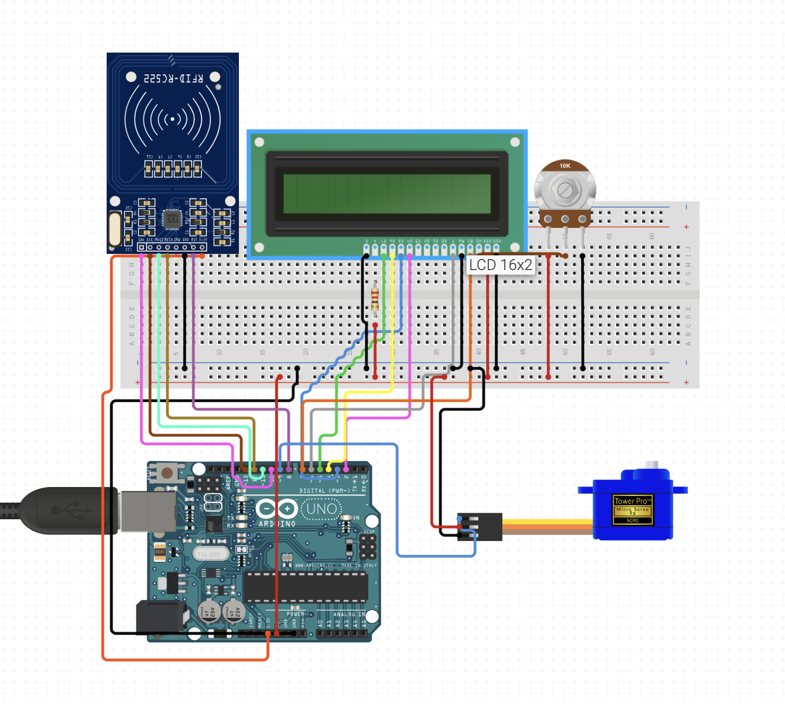

# RFID Locker System with Arduino

This project implements a secure locker system using an **RFID RC522
module**, a **16x2 LCD**, and a **Servo motor** controlled by an
**Arduino Uno**.\
When an authorized RFID card is scanned, the servo unlocks the locker
and displays an "Access Granted" message.\
Unauthorized cards trigger an "Access Denied" message.

------------------------------------------------------------------------

## Features

-   RFID card authentication (RC522)
-   Servo-controlled locking mechanism
-   16x2 LCD feedback messages
-   Easy to configure authorized card UID
-   Clean and modular Arduino code

------------------------------------------------------------------------

## Circuit Schematic

The schematic for the full wiring setup can be found below:



------------------------------------------------------------------------

## Components Used

-   Arduino Uno
-   RC522 RFID Reader
-   16x2 LCD Display (parallel)
-   10K Potentiometer (LCD contrast)
-   SG90 / 9g Servo Motor
-   Breadboard + jumper wires
-   RFID Cards / Tags

------------------------------------------------------------------------

## How It Works

1.  The RC522 continuously scans for RFID cards.
2.  When a card is detected, its UID is read.
3.  If the UID matches the **authorized UID** defined in the code:
    -   Servo rotates to the unlock position\
    -   LCD shows **Access Granted**
4.  After a short delay, the servo returns to the locked position.
5.  If the card is NOT authorized:
    -   LCD shows **Access Denied**

------------------------------------------------------------------------

## Setup Instructions

1.  Wire everything according to the schematic image above.

2.  Install the required Arduino libraries:

    -   `MFRC522`
    -   `LiquidCrystal`
    -   `Servo`

3.  Upload the Arduino code to your board.

4.  Open the Serial Monitor and scan your RFID card to obtain its UID.

5.  Replace the UID in the code:

    ``` cpp
    String authorizedUID = "XX XX XX XX";
    ```

6.  Upload the updated code.

------------------------------------------------------------------------

## ▶Running the System

1.  Power the Arduino.
2.  LCD will initialize and wait for an RFID scan.
3.  Present your card:
    -   Valid → Locker unlocks
    -   Invalid → Access denied

------------------------------------------------------------------------

## License

This project is open-source under the **MIT License**.\
Feel free to modify and improve it.

------------------------------------------------------------------------

## Author

Rúben Barbosa --- *Software Engineer Student*
